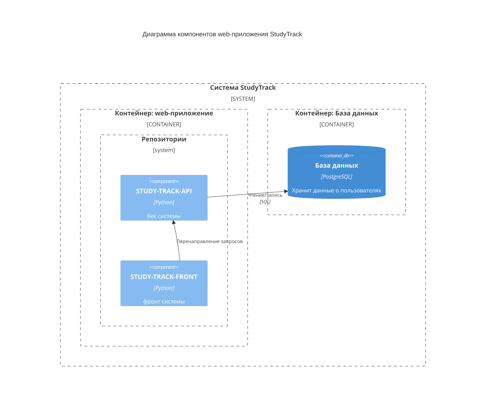

# Диаграмма компонентов
Диаграмма компонентов показывает внутреннюю структуру контейнера, разбивая его на логические компоненты (модули, классы, сервисы) и связи между ними.

## Описание диаграммы
Диаграмма отображает внутреннюю структуру системы  на уровне компонентов. Система разделена на два основных контейнера:
1. Контейнер web-приложения включает:
  - Репозитории (работают с данными через БД).
2. Контейнер базы данных:
  - PostgreSQL (хранит данные пользователей и их вопросы)

Ключевые взаимодействия:
- Репозиторий фронта отправляет запрос в бек.
- Репозиторий бека обрабатывает информацию из базы данных в соответствии с запросом.