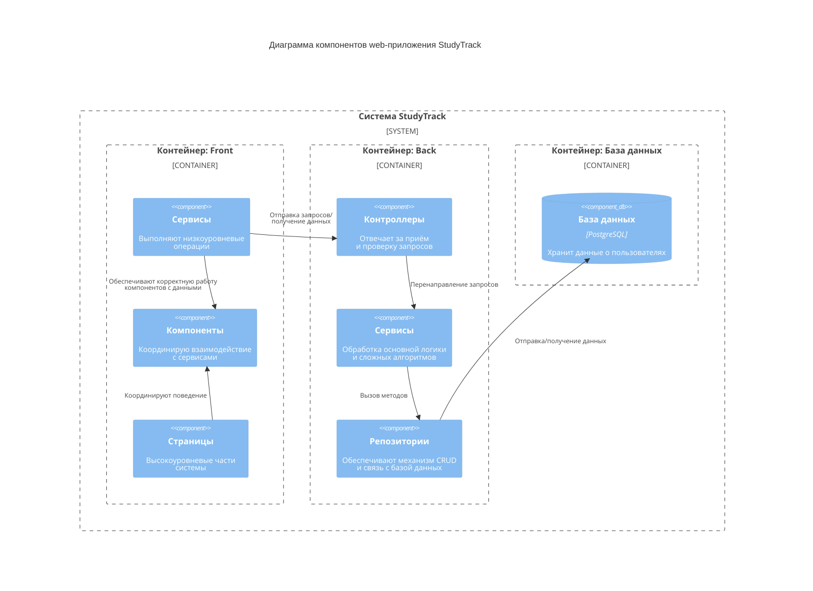

# Диаграмма компонентов
Диаграмма компонентов показывает внутреннюю структуру контейнера, разбивая его на логические компоненты (модули, классы, сервисы) и связи между ними.

## Описание диаграммы
Диаграмма отображает внутреннюю структуру системы  на уровне компонентов. Система разделена на три основных контейнера:
1. Контейнер Back включает:
  - Контроллеры (принимают и проверяют запросы сервиса)
  - Сервисы (выполняют запросы сервиса, вызывают методы)
  - Репозитории (работают с данными через БД).
3. Контейнер Front включает:
  - Сервисы (обеспечивают связь фронта и бека)
  - Компоненты (обрабатывают бизнес-логику и взаимодействие с сервисами)
  - Страницы (включают набор компонентов и взаимодействует с сервисами для обработки данных)
4. Контейнер базы данных:
  - PostgreSQL (хранит данные пользователей и их вопросы)

Ключевые взаимодействия:
- Репозиторий фронта отправляет запрос в бек.
- Репозиторий бека обрабатывает информацию из базы данных в соответствии с запросом.