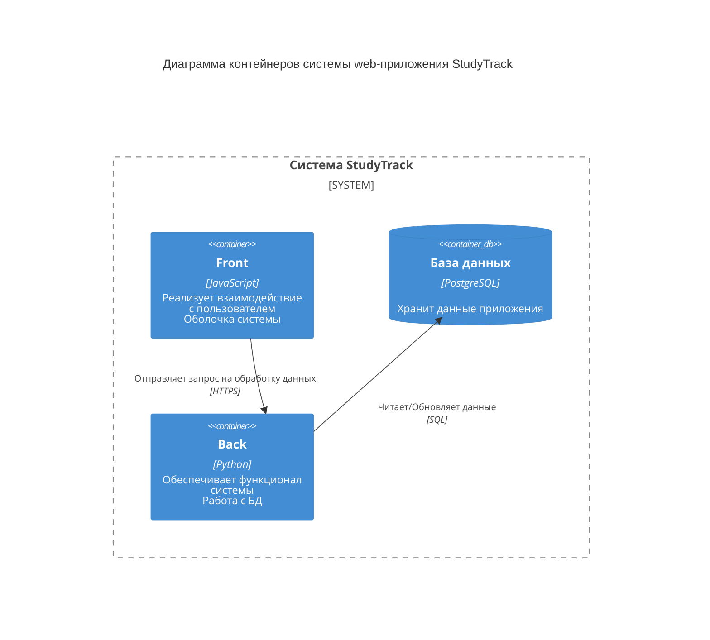

# Диаграмма контейнеров
Диаграмма контейнеров C4 показывает высокоуровневую архитектуру системы, выделяя основные подсистемы внутри границ рассматриваемой системы и их взаимодействие с внешними системами.

## Описание контейнеров:
1. Web-приложение (Python):
- Создание задач и сроков.
- Обновление информации.
2. База данных (PostgreSQL):
- Хранит данные о пользователях (пароли, имена, список задач и т.д.).

## Внешние системы:
1. API — сервер для работы web-приложения. Обеспечивает коммуникацию с пользователями.