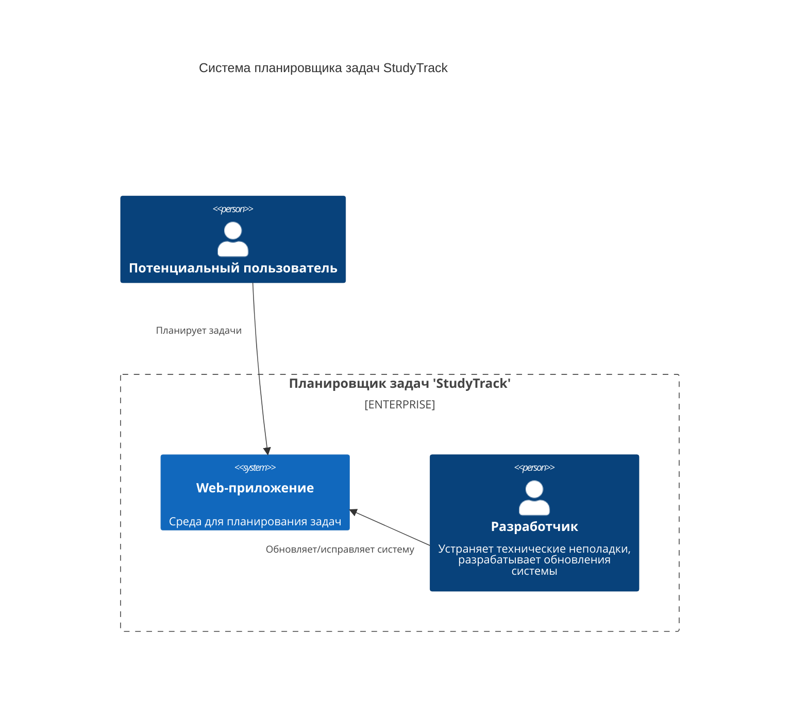

# Диаграмма Контекста
 Диаграмма показывает систему в масштабе ее взаимодействия с пользователями и другими системами.

## Описание компонентов
1. Потенциальный пользователь. Человек, использующий функционал системы для своих нужд.
2. Web-приложение. Среда для планирования задач, обеспечивающая пользователя всем необходимым для этого функционалом.
3. Разработчик. Контролирует постоянное функционирование и/или регулярное обновление системы.

## Описание взаимодействий
1. Пользователь планирует задачи в системе (создает список задач, выставляет дедлайны и т.д.).
2. Разработчик работает непосредственно с "внутренней частью системы" (программный код, база данных и т.д.), для решения технических задач.