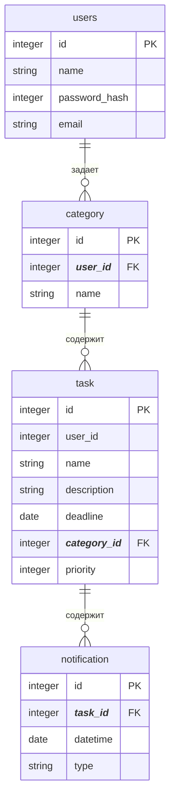

## ER-диаграмма базы данных

```mermaid
erDiagram
    users {
        integer id PK
        string name
        integer password_hash
        string email
    }

    category {
        integer id PK
        integer ***user_id*** FK
        string name
    }

    task {
        integer id PK
        integer user_id
        string name
        string description
        date deadline
        integer ***category_id*** FK
        integer priority
    }

    notification {
        integer id PK
        integer ***task_id*** FK
        date datetime
        string type
    }


    users ||--o{ category : "задает"
    category ||--o{ task : "содержит"
    task ||--o{ notification : "содержит"
    
```
